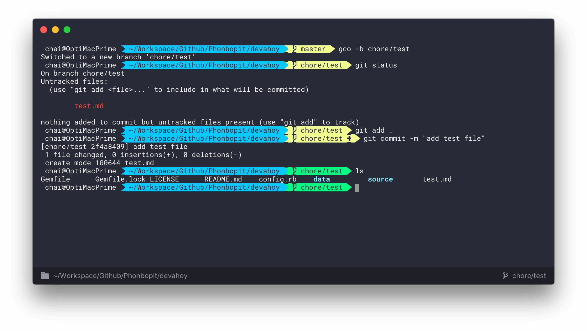

# my-hyper
My Hyper Configuration

## Required

* [Powerline Font](https://github.com/powerline/powerline)
* [Oh MY ZSH](https://github.com/robbyrussell/oh-my-zsh)
* [agnoster theme](https://github.com/agnoster/agnoster-zsh-theme)

